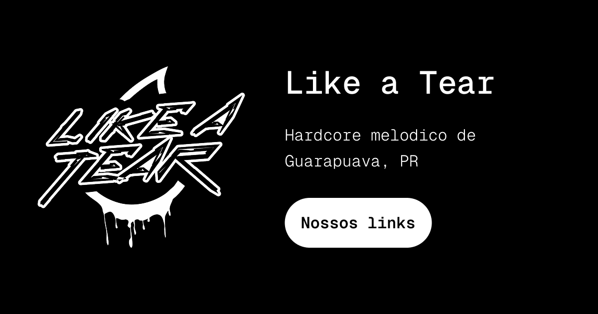

<div align="center">
  

  <h1>
    🎛️ Like a Links
  </h1>

  > Like a Tear band links micro website 🔥
</div>

## 💡 You will need

- First, a cup of coffee; ☕
- Then, [Bun](https://bun.sh/) installed on your host.

## 🎉 Starting

### Clone

In order to clone the project (via HTTPS), run this command:

```bash
git clone https://github.com/MattZ6/likealinks.git
```

> 💡 SSH URLs provide access to a Git repository via SSH, a secure protocol. If you have a SSH key registered in your Github account, clone the project using this command: `git clone git@github.com:MattZ6/likealinks.git`


Go to project folder:

```bash
cd likealinks
```

### Dependencies

Install the project dependencies:

```bash
bun i
```
> You can also use `npm`, `yarn` or `pnpm` instead.

### Develop

Start local development server:

```
bun dev
```

## 🤝 Contributing

> Contributions, issues and new features are **always welcome**! You can explore them [here](https://github.com/MattZ6/likealinks/issues).

Feel free to submit a new issue with a respective title and description on the the **🎛️ Like a Links** repository. If you already found a solution to your problem, I would love to review your pull request! Have a look at our [contribution guidelines](.github/CONTRIBUTING.md) to find out about the coding standards.

___

<div align="center">
  <strong>💧 Like a Tear</strong>
</div>
